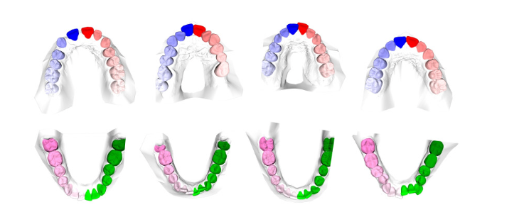

# OrthoTwin3D

**DGCNN baseline for 3D intra-oral tooth segmentation on Teeth3DS.**

Controlled pipeline from raw intra-oral meshes to scan-level point-cloud
segmentation with a compact 17-class jaw-normalized target.



## Overview

- Teeth3DS / 3DTeethLand preprocessing and `.pt` scan export.
- Patient-level splits with split-specific processed folders.
- DGCNN segmentation with mIoU, mean F1, checkpoints, JSONL logs, and optional
  W&B tracking.
- Configurable input features: `pos + normal` or `pos + normal + jaw_code`.

## Project Direction

The current repo focuses on the data foundation and DGCNN segmentation
baseline. The project plan extends this into an anatomy-aware pipeline.

| Stage | Goal |
| --- | --- |
| Data foundation | Stable scan-level `.pt` samples with patient-level splits |
| Segmentation | DGCNN baseline for 17-class tooth/background labels |
| Instances and landmarks | Convert point labels into tooth instances and anatomical landmarks |
| Geometry | Derive tooth and arch indices from predictions |
| Geometry-constrained learning | Compare segmentation-only, multi-task, and geometry-constrained models |
| PTv3 extension | Fine-tune a stronger point-transformer backbone on the same tasks |

The geometric measurements are research proxies derived from annotations; they
are not clinical diagnoses.

## Target

The training target is compact and reversible:

```text
0     = gingiva/background
1..16 = tooth position inside one arch
```

FDI labels are stored in each processed sample and can be restored when needed.

## Data Layout

`DATA_DIR` controls the persistent dataset root:

```text
DATA_DIR/
  raw/
  splits/
    <split_name>/
  processed/
    <split_name>/
      train/*.pt
      val/*.pt
```

Processed scans contain normalized geometry, normals, labels, instances,
landmarks, tooth centers, and metadata.

## Sampling

Preprocessing stores geometry-only FPS scans with 60,000 points. Training uses
deterministic overlapping 15,000-point views; class imbalance is handled in the
loss. See [doc/sampling.md](doc/sampling.md).

## Experiments

| Experiment | Result | Artifacts |
| --- | --- | --- |
| [`DGCNN input features`](experiments/dgcnn_input_features_comparison_teethseg22/dgcnn_input_features.md) | `jaw_code` gives no clear gain. Baseline: `pos + normal`, mIoU 0.6370, F1 0.7382. | configs, figures, shared model weights |

## Quick Start

```bash
python3 -m venv .venv
source .venv/bin/activate
python -m pip install -r requirements.txt
```

Prepare data:

```bash
python scripts/download_teeth3ds.py
python scripts/create_patient_splits.py
python scripts/prepare_data.py --all_splits --num_points 60000 --num_workers 4
python scripts/check_dataset_integrity.py --expected_num_points 60000 --allow_skipped
```

Train locally:

```bash
python scripts/train_segmentation.py \
  --config configs/train/dgcnn_segmentation.yaml
```

Resume:

```bash
python scripts/train_segmentation.py \
  --config configs/train/dgcnn_segmentation.yaml \
  --resume outputs/experiments/dgcnn_fps60k_mv15000_val10v_eval5_bs16/checkpoints/last.pt
```

## Reference

| Path | Role |
| --- | --- |
| `configs/data.yaml` | Dataset paths, split source, features, targets, dataloaders |
| `configs/train/dgcnn_segmentation.yaml` | Local DGCNN baseline |
| `configs/train/dgcnn_segmentation_ovh_gpu.yaml` | OVH GPU DGCNN baseline |
| `scripts/create_patient_splits.py` | Build patient-level split files |
| `scripts/prepare_data.py` | Convert raw scans to processed `.pt` samples |
| `scripts/check_dataset_integrity.py` | Validate processed data before training |
| `scripts/train_segmentation.py` | Train or resume segmentation models |
| `src/datasets/` | Labels, raw loading, processed dataset |
| `src/models/dgcnn.py` | DGCNN segmentation model |
| `src/training/` | Losses, task, trainer, metrics, loggers, checkpoints |
