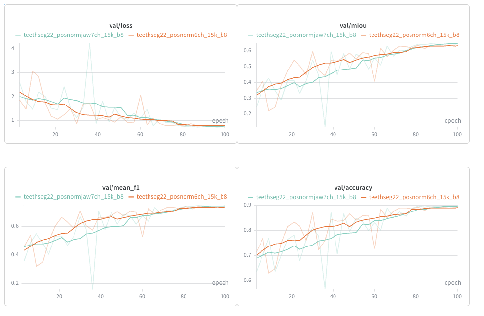
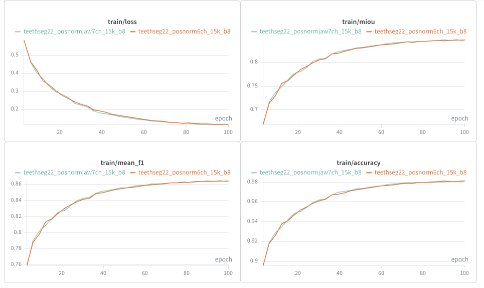

# DGCNN Input Features

This experiment compares `pos + normal` against `pos + normal + jaw_code` on
the same DGCNN TeethSeg22 setup. `jaw_code` is a constant per-point feature
derived from the scan jaw (`0=lower`, `1=upper`); the target stays the same
17-class jaw-normalized segmentation.

## Setup

| Field | Value |
| --- | --- |
| Dataset | TeethSeg22 split |
| Train / val size | ~1200 / ~600 scans |
| Target | `y_arch_class`, 17 classes |
| Points | 15k sampled from 60k processed points |
| Batch size | 8 |
| Epochs | 100 |
| Model | DGCNN, k=20, emb=1024, dropout=0.3 |
| Loss | capped CE + Dice + binary tooth/background CE |
| Optimizer | AdamW, lr=0.001, cosine scheduler |
| Validation | every 3 epochs |
| OVH flavor | `ai1-le-1-gpu`, Tesla V100S ~32 GB |

## Results and Decision

| Run | Input | Channels | Result | Decision |
| --- | --- | ---: | --- | --- |
| `teethseg22_posnorm6ch_15k_b8` | `pos + normal` | 6 | best val mIoU 0.6370; slightly more stable validation curves | Selected |
| `teethseg22_posnormjaw7ch_15k_b8` | `pos + normal + jaw_code` | 7 | comparable final metrics; no clear gain | Not retained |

The next experiments continue with the simpler `pos + normal` representation.

| Checkpoint | Epoch | Step | Val mIoU | Val mean F1 | Val accuracy | Val loss |
| --- | ---: | ---: | ---: | ---: | ---: | ---: |
| `best_posnorm6ch.pt` | 87 | 13050 | 0.6370 | 0.7382 | 0.8942 | 0.7782 |

## Curves

## Artifacts

`config_posnorm6ch.yaml`, `config_posnormjaw7ch.yaml`, `best_posnorm6ch.pt`,
`best_posnormjaw7ch.pt`, and `figures/`.
